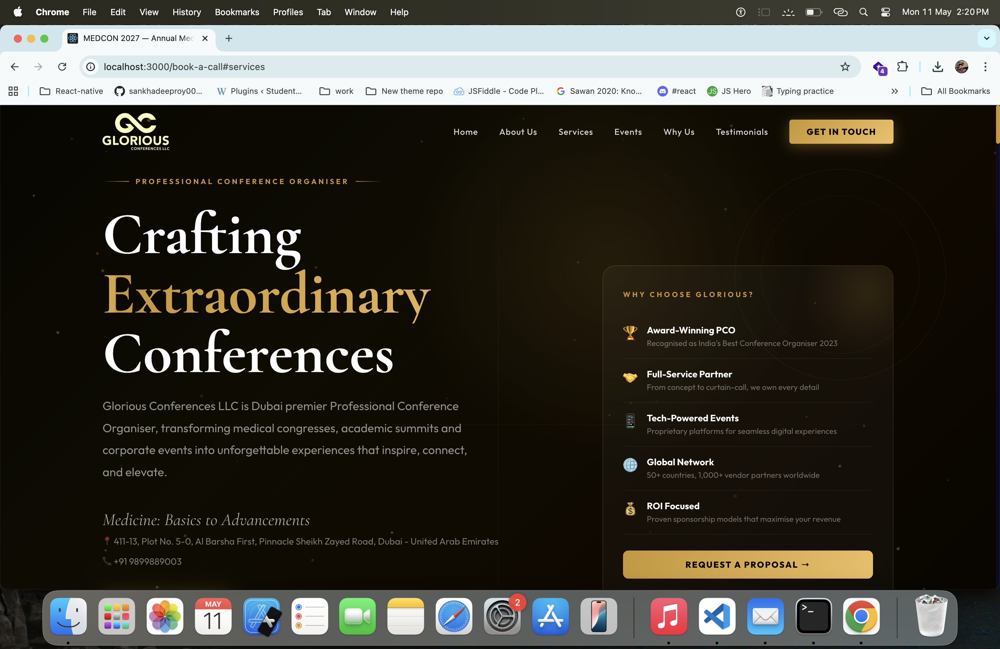
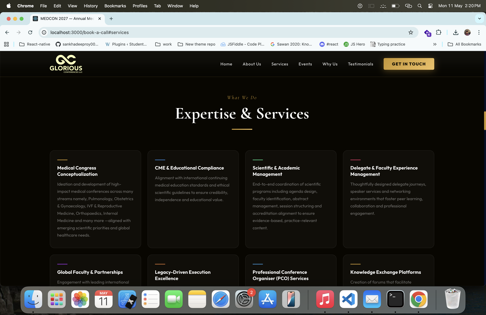
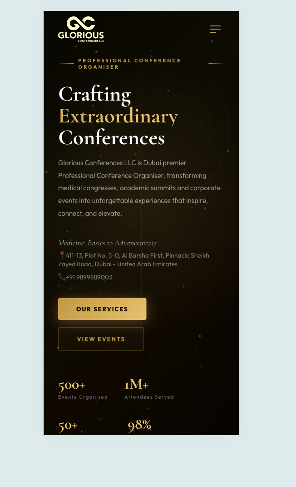

# Medical Conference Website

A modern and responsive Medical Conference Website built with ReactJS.  
This project is designed for medical events, healthcare summits, scientific conferences, and professional gatherings with smooth animations, modern UI, and fully responsive layouts.

---

## 🌐 Live Demo

🔗 https://medical-conference-website.vercel.app/

---

## 📸 Screenshots

### Page







---

## 🚀 Features

- Modern Medical Conference UI
- Fully Responsive Design
- Smooth Animations & Effects
- Interactive User Experience
- Conference Information Sections
- Speaker Showcase
- Event Schedule Layout
- Registration Call-to-Action
- Optimized Performance
- Clean & Scalable Code Structure

---

## 🛠️ Tech Stack

- ReactJS
- JavaScript (ES6+)
- HTML5
- CSS3
- Vercel

---

# 📦 Installation & Setup

## 1️⃣ Clone the Repository

```bash
git clone https://github.com/your-username/medical-conference-website.git
```

---

## 2️⃣ Navigate to Project Folder

```bash
cd medical-conference-website
```

---

## 3️⃣ Install Dependencies

Using npm:

```bash
npm install
```

Or using yarn:

```bash
yarn install
```

---

## 4️⃣ Start Development Server

Using npm:

```bash
npm start
```

Or using yarn:

```bash
yarn start
```

---

## 5️⃣ Open in Browser

```bash
http://localhost:3000
```

---

# 🏗️ Build for Production

```bash
npm run build
```

Production build files will be generated inside the `build` folder.

---

# 🚀 Deployment

This project is deployed on Vercel.

### Live URL

https://medical-conference-website.vercel.app/

### Deploy on Vercel

Install Vercel globally:

```bash
npm install -g vercel
```

Deploy project:

```bash
vercel
```

---

# 📂 Project Structure

```bash
medical-conference-website/
│
├── public/
├── src/
│   ├── assets/
│   ├── components/
│   ├── pages/
│   ├── styles/
│   ├── App.js
│   └── index.js
│
├── package.json
├── README.md
└── .gitignore
```

---

# 📱 Responsive Design

Optimized for:

- Desktop
- Laptop
- Tablet
- Mobile Devices

---

# 🎨 UI Highlights

- Modern Hero Section
- Medical Theme Layout
- Gradient Effects
- Animated Components
- Smooth Scrolling
- Professional Conference Design

---

# 👨‍💻 Author

Developed by Rohit Chauhan

---

# 📄 License

This project is licensed under the MIT License.